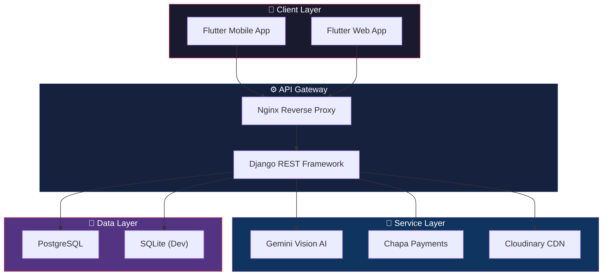

<div align="center">

# 🌍 AfriLens

### *Scan the culture. Own the craft.*

[](https://python.org)
[](https://djangoproject.com)
[](https://flutter.dev)
[](https://dart.dev)
[](https://ai.google.dev)
[](https://docker.com)
[](LICENSE)

---

**An AI-powered cultural exploration platform that transforms how guests at Kuriftu Resort discover, learn about, and purchase authentic Ethiopian cultural artifacts.**

[🚀 Live Demo](https://afri-lens-web.vercel.app) · [📖 API Docs](docs/api.md) · [🏗️ Architecture](docs/architecture.md) · [🤖 AI Deep Dive](docs/AI_SERVICES_DEEP_DIVE.md)

</div>

---

## 📋 About

**AfriLens** is a full-stack mobile and web application designed for **Kuriftu Resort & Spa**, one of Ethiopia's premier luxury destinations. The platform empowers resort guests to point their phone camera at any cultural artifact — a hand-woven basket, a traditional coffee pot (*jebena*), an intricate jewelry piece — and instantly receive AI-generated insights about its history, craftsmanship, and cultural significance.

The platform bridges the gap between **cultural curiosity and commerce**. After scanning an artifact with Google Gemini Vision AI, guests receive rich storytelling about the item — its regional origins, the artisan techniques behind it, and its role in Ethiopian heritage. They can then seamlessly purchase the artifact (or similar items) through an integrated Chapa payment gateway, turning a cultural moment into a meaningful souvenir.

AfriLens was built to solve a real problem: resort guests are surrounded by beautiful cultural objects but lack context about what they're seeing. Traditional signage is static and limited. AfriLens makes every artifact interactive, educational, and purchasable — creating a richer guest experience while supporting local artisans and cultural preservation.

---

## ✨ Key Features

| Feature | Description |
|---------|-------------|
| 🔍 **AI Artifact Scanning** | Point your camera at any cultural artifact — Gemini Vision AI identifies it and provides instant cultural context |
| 📖 **Cultural Storytelling** | AI-generated narratives about artifact history, craftsmanship, regional origins, and cultural significance |
| 💳 **Secure Payments** | Integrated Chapa payment gateway for seamless artifact purchases with mock mode for testing |
| ☁️ **Cloud Image Hosting** | Cloudinary integration for optimized image storage, transformation, and delivery |
| 🔐 **JWT Authentication** | Secure token-based auth with access/refresh tokens and automatic renewal |
| 👥 **Role-Based Access** | Three-tier roles — Guest, Admin, and Super Admin — with granular permissions |
| 🏨 **Villa Guides** | Interactive guides for Kuriftu's villa accommodations with rich media |
| 📱 **QR Code Scanning** | Scan QR codes placed near artifacts for instant identification |
| 🐳 **Docker Deployment** | Production-ready containerization with Docker Compose, Gunicorn, and Nginx |
| 🧪 **Mock Testing Mode** | Full offline testing capability with simulated AI and payment responses |

---

## 🛠️ Tech Stack

| Layer | Technology | Purpose |
|-------|-----------|---------|
| **Backend** | Django 5.x + Django REST Framework | REST API, business logic, admin panel |
| **Frontend** | Flutter 3.x + Dart | Cross-platform mobile & web UI |
| **AI Engine** | Google Gemini Pro Vision | Artifact recognition, cultural storytelling |
| **Database** | PostgreSQL (prod) / SQLite (dev) | Persistent data storage |
| **Authentication** | SimpleJWT | Access & refresh token management |
| **Payments** | Chapa API | Ethiopian payment processing |
| **Image Storage** | Cloudinary | Cloud-based image hosting & CDN |
| **Deployment** | Docker + Nginx + Gunicorn | Production containerization & reverse proxy |
| **Hosting** | Render | Cloud platform deployment |

---

## 🏗️ Architecture



---

## 📸 Screenshots

<div align="center">

| Home Screen | Artifact Scan |
|:-----------:|:-------------:|
| *Discover cultural artifacts at Kuriftu Resort* | *AI-powered artifact recognition in action* |

| Cultural Story | Checkout |
|:--------------:|:--------:|
| *Rich AI-generated cultural narratives* | *Seamless Chapa payment integration* |

</div>

> 📌 *Screenshots coming soon — the app is under active development.*

---

## 🚀 Getting Started

> 💡 **Live Demo & APK**: You can try the live web version or download the Android APK directly at [afri-lens-web.vercel.app](https://afri-lens-web.vercel.app).

### Prerequisites

- [Flutter SDK](https://flutter.dev/docs/get-started/install) 3.x+
- [Python](https://python.org) 3.11+
- [Docker](https://docker.com) & Docker Compose (for containerized deployment)
- [Git](https://git-scm.com)
- A [Google Gemini API Key](https://ai.google.dev)
- A [Chapa](https://chapa.co) account (for payment testing)

### Backend Setup

```bash
# Clone the repository
git clone https://github.com/rebiraolin/Kuriftu-AI-Cultural-Exploration-Platform.git
cd Kuriftu-AI-Cultural-Exploration-Platform/backend

# Copy environment template and fill in your keys
cp .env.example .env
# Edit .env with your actual API keys and credentials

# Option A: Run with Docker (recommended)
docker-compose up --build -d

# Option B: Run locally with Python
python -m venv venv
source venv/bin/activate        # On Windows: venv\Scripts\activate
pip install -r requirements.txt
python manage.py migrate
python manage.py createsuperuser
python manage.py runserver
```

### Frontend Setup

```bash
cd frontend

# Install dependencies
flutter pub get

# Run on connected device or emulator
flutter run

# Run on web
flutter run -d chrome

# Build release APK
flutter build apk --release
```

### Environment Variables

See [`backend/.env.example`](backend/.env.example) for all required configuration:

| Variable | Description |
|----------|-------------|
| `GEMINI_API_KEY` | Google Gemini AI API key |
| `SECRET_KEY` | Django secret key |
| `DEBUG` | Debug mode (`True`/`False`) |
| `DATABASE_URL` | Database connection string |
| `CHAPA_SECRET_KEY` | Chapa payment API key |
| `CHAPA_MOCK_MODE` | Enable mock payments for testing |
| `CLOUDINARY_URL` | Cloudinary connection string |

---

## 📡 API Endpoints

| Method | Endpoint | Description | Auth |
|--------|----------|-------------|------|
| `POST` | `/api/auth/register/` | Register a new user account | ❌ |
| `POST` | `/api/auth/login/` | Authenticate and receive JWT tokens | ❌ |
| `POST` | `/api/auth/token/refresh/` | Refresh an expired access token | 🔑 |
| `GET` | `/api/countries/` | List all countries with cultural data | ❌ |
| `GET` | `/api/artifacts/` | Browse the artifact catalog | ❌ |
| `GET` | `/api/artifacts/:id/` | Get detailed artifact information | ❌ |
| `POST` | `/api/ai/scan/` | Scan an artifact image with Gemini AI | 🔑 |
| `POST` | `/api/ai/story/` | Generate cultural story for an artifact | 🔑 |
| `POST` | `/api/orders/` | Create a new purchase order | 🔑 |
| `GET` | `/api/orders/` | List user's order history | 🔑 |
| `POST` | `/api/orders/:id/verify/` | Verify Chapa payment status | 🔑 |

> 📖 For complete API documentation with request/response examples, see [`docs/api.md`](docs/api.md)

---

## 📁 Project Structure

```
Kuriftu-AI-Cultural-Exploration-Platform/
├── backend/
│   ├── config/              # Django project settings & URL configuration
│   ├── ai_services/         # Gemini AI integration (scanning, storytelling, embeddings)
│   ├── artifacts/           # Cultural artifact models, views, serializers
│   ├── orders/              # Purchase orders & Chapa payment integration
│   ├── users/               # Custom user model, JWT auth, role management
│   ├── notifications/       # In-app notification system
│   ├── media/               # User-uploaded files (gitignored)
│   ├── Dockerfile           # Production container image
│   ├── docker-compose.yml   # Multi-service orchestration
│   ├── nginx.conf           # Reverse proxy configuration
│   ├── requirements.txt     # Python dependencies
│   └── manage.py            # Django management CLI
│
├── frontend/
│   ├── lib/
│   │   ├── main.dart        # App entry point & routing
│   │   ├── screens/         # 14 app screens (home, scan, profile, orders, etc.)
│   │   ├── services/        # API, auth, scan, and platform services
│   │   ├── models/          # Dart data models
│   │   ├── providers/       # State management (Provider)
│   │   ├── widgets/         # Reusable UI components
│   │   └── theme/           # App theming & design tokens
│   ├── android/             # Android platform configuration
│   ├── ios/                 # iOS platform configuration
│   ├── web/                 # Web platform configuration
│   └── pubspec.yaml         # Flutter dependencies
│
├── docs/
│   ├── api.md               # REST API documentation
│   ├── architecture.md      # System architecture overview
│   ├── AI_SERVICES_DEEP_DIVE.md  # Detailed AI integration guide
│   ├── BACKEND_IMPLEMENTATION_SUMMARY.md
│   └── PROJECT_IDEA.md      # Original project concept
│
├── .gitignore               # Root-level git ignore rules
├── LICENSE                  # MIT License
└── README.md                # This file
```

---

## 🤝 Contributing

Contributions are welcome! Here's how to get started:

1. **Fork** the repository
2. **Create** a feature branch (`git checkout -b feature/amazing-feature`)
3. **Commit** your changes (`git commit -m 'feat: add amazing feature'`)
4. **Push** to the branch (`git push origin feature/amazing-feature`)
5. **Open** a Pull Request

Please use [conventional commit](https://www.conventionalcommits.org/) messages and ensure your code passes all existing tests before submitting.

---

## 📄 License

This project is licensed under the **MIT License** — see the [LICENSE](LICENSE) file for details.

---

## 🙏 Acknowledgments

- **[Kuriftu Resort & Spa](https://kurifturesorts.com)** — for the inspiration and real-world context behind this platform
- **Google Gemini AI** — for powering the artifact recognition and cultural storytelling engine
- **Team Contributors:**
  - [@mosisafeyissa](https://github.com/mosisafeyissa)
  - [@ashenafi-16](https://github.com/ashenafi-16)
  - [@Annabdiyu](https://github.com/Annabdiyu)
  - [@npholy](https://github.com/npholy)
  - [@rebiraolin](https://github.com/rebiraolin)

---

<div align="center">

**Built with ❤️ for Ethiopian cultural heritage**

[](https://flutter.dev)
[](https://ai.google.dev)

</div>
